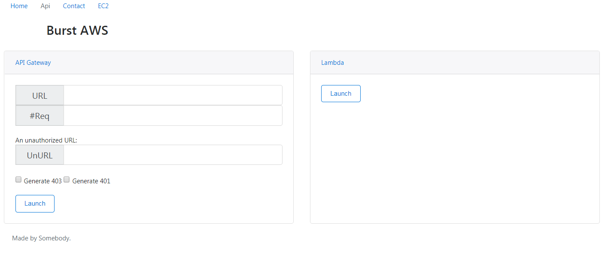

# HTTP AWS Burst

Simple Web Server in GO to burst AWS Services in order to retrieve metrics 

Aim is to have only one console for AWS Burst Purpose

### Prerequisite

You need to have:

* Go 1.8
* Go Environment properly set


### Compilation

```sh
git clone http://YOURUIDN@code.int.be.continental.cloud/scm/toam/awsburst.git
go build -o awsburst
```

### Access

Access through favorite web browser on http://YOURIP:YOURPORT ie http://127.0.0.1:9040


### API

Auto Health Check API status available at /healthy/am-i-up

### ScreenShot

HTTP Burst:


EC2 Instance Details


### ToDo

- [x] Add URL User input
- [x] Add Number of request input
- [x] Add Generate 4xx or 5xx input
- [ ] API Doc
- [ ] Build Docker App
- [x] Add EC2 Retrieve Instance
- [x] Instance in HTML view
- [ ] Add Filter input for Instace HTML View
- [ ] Add Lambda burst support